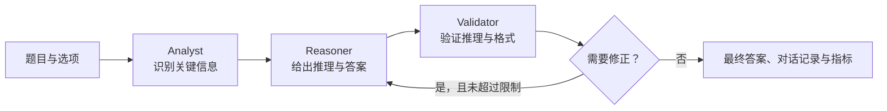

# MAQAS：多智能体问答与评估系统

MAQAS 是一个面向 **CommonsenseQA 多选常识问答** 的多智能体实验框架。系统以 LangGraph 编排 `Analyst → Reasoner → Validator` 三个角色：先分析题意，再进行推理，最后验证答案；验证发现问题时会把反馈交回推理角色进行有限次数的修正。

除基础问答外，项目提供完整的四维评估、S1–S6 消融对比、线程并发、指数退避、JSONL 断点续跑、真实 API token 用量统计和实验结果可视化能力。

> 本项目会调用兼容 OpenAI Chat Completions 的模型 API。请自行承担 API 费用，并在小样本上验证配置后再运行完整实验。

## 功能概览

- 三角色顺序协作：`Analyst` 分析、`Reasoner` 推理、`Validator` 验证与反馈。
- 有限修正循环：Validator 要求修正时回到 Reasoner；当前实现最多触发两次修正。
- 单智能体与上下文等价基线：将信息增益与协作机制增益分开测量。
- 四维评估：个体推理、协作效率、系统稳定性、任务完成度。
- 六组消融实验：可分别关闭分析、验证与修正机制。
- 面向长实验的工程能力：线程池并发、429/超时/5xx 重试、指数退避、JSONL checkpoint 和自动续跑。
- 可视化：生成准确率、协作增益、答案格式质量、确定性、通信开销与稳定性等图表。

## 系统流程



`MASQuestionAnswering` 还提供两类对照：

- **单智能体基线**：只运行 Reasoner，作为最基础的准确率参考。
- **上下文等价基线**：把 Analyst 输出提供给独立 Reasoner，但不使用 Validator 或修正循环，用于区分“多了一段上下文”与“协作机制本身”的效果。

## 目录结构

```text
.
├── data/                         # CommonsenseQA JSONL 数据集
│   ├── dev_rand_split.jsonl
│   └── train_rand_split.jsonl
├── docs/                         # 补充说明与答辩资料
│   ├── PROJECT_EXPLANATION.md
│   └── 答辩与验收模拟问答.md
├── ablation.py                   # 可配置 MAS 与 S1–S6 消融配置
├── concurrent_runner.py          # 并发、重试和 checkpoint 执行器
├── config.py                     # 环境变量与系统配置
├── data_loader.py                # CommonsenseQA 数据加载
├── evaluator.py                  # I1–I4 评估指标
├── experiments.py                # 完整四维评估主流程
├── llm_client.py                 # 兼容 Chat Completions 的 API 客户端
├── main.py                       # 完整评估命令行入口
├── plot_results.py               # 实验结果图表
├── draw.py                       # 答案格式与确定性堆叠图
├── run_ablation.py               # 消融实验命令行入口
├── schemas.py                    # LangGraph 共享状态定义
├── utils.py                      # 答案抽取、格式化和选项排列工具
├── .env.example                  # 无密钥的环境变量模板
└── requirements.txt
```

本地生成的 `.env`、`.venv/`、`venv/`、`results/`、`checkpoints/`、缓存、IDE 配置和日志都由 `.gitignore` 排除，不应提交。

## 环境准备

需要 Python 3.10 或更高版本。

```bash
git clone https://github.com/Larry-Wayn/MASeval.git
cd MASeval

python3 -m venv .venv
source .venv/bin/activate            # Windows PowerShell: .venv\Scripts\Activate.ps1
python -m pip install --upgrade pip
pip install -r requirements.txt

cp .env.example .env
```

编辑 `.env`，至少填入 API Key：

```dotenv
DEEPSEEK_API_KEY=your-api-key
DEEPSEEK_MODEL=deepseek-v4-flash
DEEPSEEK_BASE_URL=https://api.deepseek.com
DEEPSEEK_TEMPERATURE=0.7

MAS_MAX_ROUNDS=5
MAS_MAX_WORKERS=8
MAS_MAX_RETRIES=3
MAS_RETRY_BASE_DELAY=2.0
```

也可以不创建 `.env`，而是在 shell 中设置相同的环境变量。`DEEPSEEK_API_KEY` 为必填项；绝不要将真实 Key 写入源码、Notebook、日志或 Git 提交。

## 运行实验

### 快速冒烟测试

先用少量样本检查 API、网络和输出目录：

```bash
python main.py --n 12 --workers 4 --num-perms 2 --stability-k 2 --stability-n 5
```

### 完整四维评估

```bash
# dev 集全量；并发数默认读取 MAS_MAX_WORKERS
python main.py

# 自定义样本数、并发数和输出目录
python main.py --data data/dev_rand_split.jsonl --n 200 --workers 8 --out results

# 忽略已有 checkpoint，重新执行
python main.py --n 200 --no-resume
```

`main.py` 会依次运行单智能体基线、多智能体和上下文等价基线、选项排列稳定性测试、重复运行稳定性测试，并生成文本报告与结构化结果。

### S1–S6 消融实验

```bash
# 建议先使用小样本
python run_ablation.py --n 20 --workers 4

# 指定数据和输出目录
python run_ablation.py --data data/dev_rand_split.jsonl --n 100 --out results

# 放弃 checkpoint 和既有汇总，强制重跑
python run_ablation.py --n 20 --no-resume
```

默认行为会复用 `results/checkpoints/` 中已完成的记录。`--no-resume` 会删除该输出目录中的 checkpoint 和消融汇总文件；请为重要实验使用不同的 `--out` 目录或先备份结果。

| 配置 | Analyst | Validator | 修正循环 | 用途 |
| --- | :---: | :---: | :---: | --- |
| S1 `SingleReasoner` | × | × | × | 单智能体基线 |
| S2 `Reasoner+Analyst` | ✓ | × | × | 上下文等价基线 |
| S3 `Reasoner+Validator` | × | ✓ | × | 验证但不修正 |
| S4 `Reasoner+Validator+Revise` | × | ✓ | ✓ | 验证与修正，不含 Analyst |
| S5 `FullMAS_NoRevise` | ✓ | ✓ | × | 完整角色，不含修正循环 |
| S6 `FullMAS` | ✓ | ✓ | ✓ | 完整三角色系统 |

### 生成图表

完整实验或消融实验完成后：

```bash
# 生成主要实验图（默认写入 results/figures/）
python plot_results.py --results results --data data/dev_rand_split.jsonl

# 生成答案提取质量与确定性 100% 堆叠图
python draw.py --data results/figures/plot_data.json --out results/figures
```

macOS、Windows 和 Linux 上的中文显示依赖本机可用字体；若图中文字显示异常，请在 `plot_results.py` 或 `draw.py` 的字体列表中加入本机字体。

## 四维评估

### I1：个体智能水平

针对单个 Reasoner，衡量：

- **推理可行性**：答案是否合法、输出是否充分、是否包含因果推理和与选项相关的依据。
- **推理覆盖质量**：是否覆盖多个选项、进行上下文相关的排除和正反比较。
- **单体准确率**：单 Agent 答案与标注答案一致的比例。

### I2：协作效率

- **协作增益**：报告 `raw_gain = multi_acc - single_acc`、`context_gain = context_acc - single_acc` 与 `pure_collab_gain = multi_acc - context_acc`。
- **协调一致性**：从 Analyst、Reasoner、Validator 输出中抽取选项，计算流水线一致率和 Cohen's κ。三个角色在流程中存在上下游依赖，因此该值应理解为流程内一致性，而非独立标注者一致性。
- **通信开销**：记录讨论轮次、修正次数、字符数，以及 API 返回的 `prompt_tokens`、`completion_tokens` 和 `total_tokens`。旧 checkpoint 缺少 usage 时会回退至启发式估算。

### I3：系统稳定性

- **选项位置偏差**：对同一道题构造多种选项排列，报告平均准确率退化、答案翻转率和位置偏好离散度（RStd）。
- **重复运行稳定性**：对部分题目重复运行，报告平均稳定性、平均 pass@1 和基于 Beta 后验的 95% 区间宽度。

### I4：任务完成度

- 完整多智能体系统的最终任务准确率。
- 答案提取质量：严格格式、标准格式、兜底提取和无法提取的比例。
- 答案确定性：明确、模糊、不确定、普通和未知输出的比例。

## 输出与复现

默认输出目录为 `results/`，主要包括：

```text
results/
├── checkpoints/                  # 各阶段 JSONL 断点
├── full_evaluation_report.txt    # 完整四维评估报告
├── full_evaluation_summary.json  # 完整评估结构化汇总
├── ablation_summary.csv          # S1–S6 消融汇总
├── ablation_summary.json
├── ablation_per_sample.json      # 每条样本的消融结果
└── figures/                      # PNG 图和 plot_data.json
```

这些文件是实验产物而非源代码，默认不纳入版本控制。为便于复现，请记录所用模型、环境变量（不含 Key）、数据文件、命令行参数、运行时间和依赖版本。

## 延伸文档

- [项目代码说明与指标细节](docs/PROJECT_EXPLANATION.md)
- [答辩与验收模拟问答](docs/答辩与验收模拟问答.md)

## 安全与使用说明

- `.env` 可能包含 API Key，始终保持本地保存；提交前使用 `git status` 与 `git diff --cached` 检查暂存内容。
- 调高 `MAS_MAX_WORKERS` 或 `--workers` 会增加并发请求和限流风险，也可能提高单位时间的 API 消耗。
- `DEEPSEEK_MODEL`、URL 和其他参数由环境变量控制；请确认所使用服务兼容 Chat Completions 请求格式。
- 本仓库提供实验框架与指标实现，不保证特定模型、提示词或配置在所有环境中得到相同分数。
