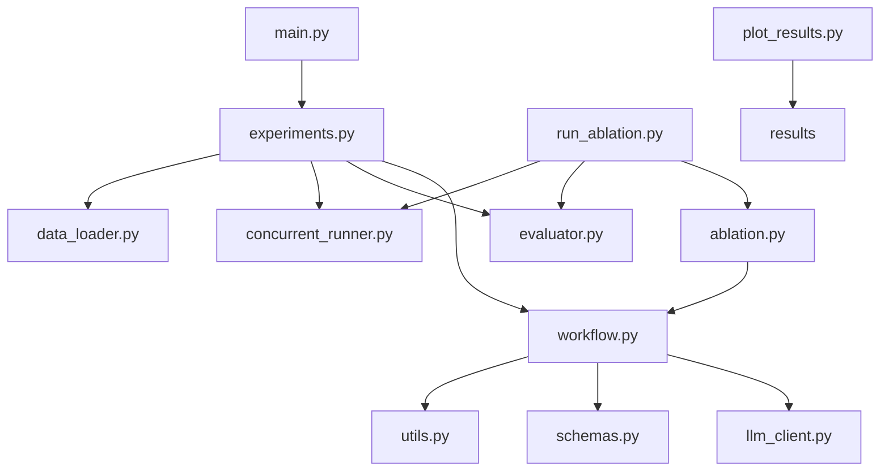
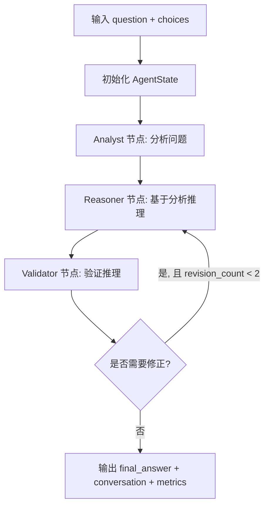
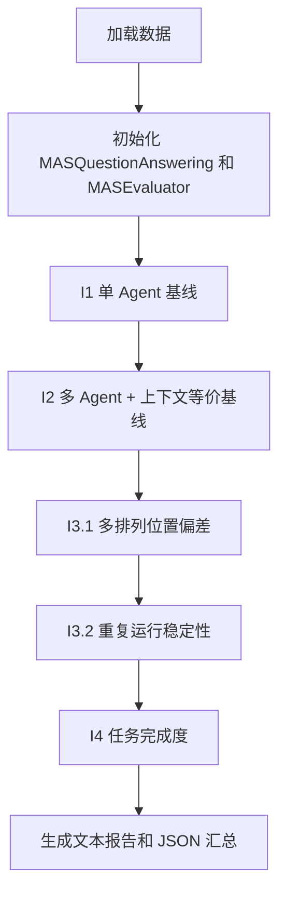
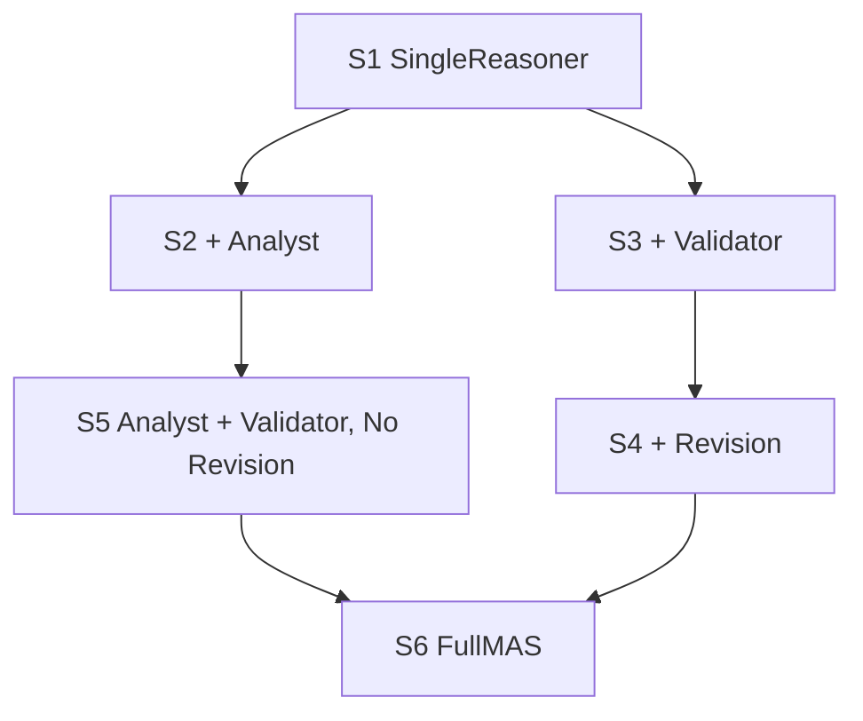
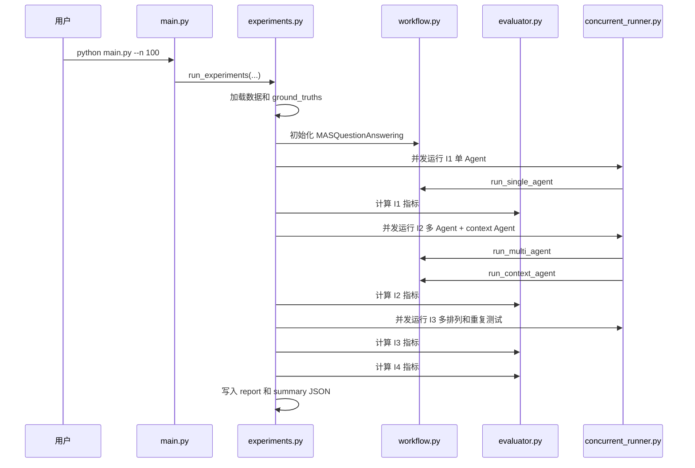

# MAQAS 项目代码说明文档

本文档用于系统说明 MAQAS 项目的代码结构、核心多智能体问答系统的运行方式、四维评估指标的计算逻辑，以及消融实验如何设计和执行。

项目面向 CommonsenseQA 多选常识问答任务，核心思想是构建一个由 `Analyst`、`Reasoner`、`Validator` 三个角色组成的多智能体系统，让系统先分析、再推理、再验证，并在必要时进行反馈修正。

---

## 1. 项目整体结构

项目主要 Python 文件的职责如下。

- `main.py`：完整四维评估实验入口，解析命令行参数，然后调用 `experiments.run_experiments()`。
- `experiments.py`：完整实验主流程，负责 I1-I4 四类指标的实验执行、并发调度、断点续跑、报告输出。
- `workflow.py`：核心多智能体系统实现，定义三个智能体节点、LangGraph 工作流、单智能体基线和上下文等价基线。
- `schemas.py`：定义 LangGraph 中共享的 `AgentState` 状态结构。
- `llm_client.py`：统一封装 DeepSeek 兼容 OpenAI Chat Completions 的调用逻辑。
- `config.py`：读取 `.env` 或环境变量中的模型配置、系统配置、并发配置。
- `utils.py`：答案抽取、问题格式化、选项打乱等工具函数。
- `data_loader.py`：加载 CommonsenseQA JSONL 数据。
- `evaluator.py`：四维评估指标的具体计算逻辑。
- `concurrent_runner.py`：通用并发执行器，支持线程池、失败重试、指数退避、JSONL 断点续跑。
- `ablation.py`：可配置的消融版多智能体系统，通过开关控制 Analyst、Validator、Revision。
- `run_ablation.py`：消融实验入口，批量运行 S1-S6 配置并生成结果。
- `plot_results.py`：读取实验结果并绘制图像。

整体关系可以概括为：



---

## 2. 配置与运行入口

### 2.1 `config.py`

`config.py` 负责读取环境变量。项目默认使用 DeepSeek API。

关键配置包括：

- `DEEPSEEK_MODEL`：模型名，默认 `deepseek-v4-flash`。
- `DEEPSEEK_API_KEY`：API Key，必填。
- `DEEPSEEK_TEMPERATURE`：采样温度，默认 `0.7`。
- `DEEPSEEK_BASE_URL`：API 地址，默认 `https://api.deepseek.com/v1`。
- `MAS_MAX_ROUNDS`：多智能体最大轮次，默认 `5`。
- `MAS_MAX_WORKERS`：并发线程数，默认 `8`。
- `MAS_MAX_RETRIES`：单条任务最大重试次数，默认 `3`。
- `MAS_RETRY_BASE_DELAY`：重试退避基数，默认 `2.0` 秒。

如果 `DEEPSEEK_API_KEY` 没有设置，项目启动时会抛出错误。

### 2.2 `main.py`

`main.py` 是完整四维实验入口，本身不实现具体实验逻辑，只负责解析参数并调用 `run_experiments()`。

常用运行方式：

```bash
python main.py
python main.py --n 200
python main.py --workers 16
python main.py --no-resume
python main.py --data data/dev_rand_split.jsonl --n 1221
```

参数含义：

- `--data`：数据文件路径。
- `--n`：样本数量，不传或传 `0` 表示跑完整数据集。
- `--workers`：并发线程数。
- `--out`：结果输出目录，默认 `results`。
- `--no-resume`：忽略断点，强制重跑。
- `--num-perms`：I3.1 多排列实验的排列数量。
- `--stability-k`：I3.2 每题重复运行次数。
- `--stability-n`：I3.2 参与重复测试的题目数。

---

## 3. 数据加载流程

数据加载由 `data_loader.py` 中的 `load_commonsenseqa_data()` 完成。

它读取 CommonsenseQA JSONL 文件，每行解析为一个样本：

```python
{
    "question": question,
    "choices": choices,
    "answer": answer_key,
}
```

其中：

- `question` 来自 `item["question"]["stem"]`。
- `choices` 来自 `item["question"]["choices"]` 中每个选项的 `text`。
- `answer` 来自 `item["answerKey"]`，通常是 `A/B/C/D/E`。

主实验中会同时构造：

```python
test_data = data
ground_truths = [item["answer"] for item in test_data]
```

之后所有准确率类指标都通过模型输出答案和 `ground_truths` 比较得到。

---

## 4. 核心多智能体系统

核心多智能体系统在 `workflow.py` 中实现，类名是 `MASQuestionAnswering`。

系统包含三个智能体：

- `Analyst`：问题分析专家。
- `Reasoner`：逻辑推理专家。
- `Validator`：逻辑验证专家。

整体运行流程如下：



### 4.1 共享状态 `AgentState`

`schemas.py` 中定义了所有智能体共享的状态：

```python
class AgentState(TypedDict):
    question: str
    choices: List[str]
    messages: Annotated[List[Dict], operator.add]
    analyst_output: str
    reasoner_output: str
    validator_output: str
    final_answer: str
    round_count: int
    needs_revision: bool
    revision_count: int
```

字段含义：

- `question`：当前题目文本。
- `choices`：选项文本列表。
- `messages`：多智能体对话记录。
- `analyst_output`：Analyst 的输出。
- `reasoner_output`：Reasoner 的输出。
- `validator_output`：Validator 的输出。
- `final_answer`：最终答案，初始为 `UNKNOWN`。
- `round_count`：验证轮数。
- `needs_revision`：Validator 是否要求修正。
- `revision_count`：已经触发的修正次数。

`messages` 的类型是 `Annotated[List[Dict], operator.add]`，表示 LangGraph 合并状态时会将新消息追加到列表中，而不是覆盖旧消息。

### 4.2 Analyst 节点

`analyst_node()` 的职责是先读题并给出分析。

它的系统提示词要求模型：

- 识别问题关键信息。
- 分解推理路径。
- 指出需要的常识知识类型。
- 给出初步倾向答案，格式为 `初步倾向:X`。

输入包括题目和选项，输出会写入：

```python
{
    "analyst_output": response,
    "messages": [{"role": "Analyst", "content": response}],
}
```

Analyst 不直接决定最终答案，它的作用是给 Reasoner 提供上下文分析。

### 4.3 Reasoner 节点

`reasoner_node()` 的职责是基于 Analyst 的分析做正式推理。

它会读取：

- `state["question"]`
- `state["choices"]`
- `state["analyst_output"]`

如果上一轮 Validator 要求修正，还会读取：

- `state["validator_output"]`

当 `needs_revision=True` 时，Reasoner 的 prompt 中会加入：

```text
验证者反馈:
{validator_output}

请根据反馈修正你的推理。
```

因此，修正循环不是简单重复调用，而是把 Validator 的批评反馈重新注入 Reasoner。

Reasoner 输出写入：

```python
{
    "reasoner_output": response,
    "messages": [{"role": "Reasoner", "content": response}],
}
```

### 4.4 Validator 节点

`validator_node()` 的职责是检查 Reasoner 的推理是否可靠。

它的系统提示词要求模型必须以两种格式之一结尾：

- 推理正确：`最终答案:X`
- 推理有误：`需要修正:（说明原因）`

Validator 输出后，代码会做两件事。

第一，判断是否需要修正：

```python
needs_revision = bool(
    re.search(r"需要修正|请.*重新.*推理|推理.*有误.*请.*修正", response)
)
```

第二，提取答案：

```python
answer = extract_answer(response)
if answer == "UNKNOWN" and not needs_revision:
    answer = extract_answer(reasoner_output)
```

也就是说，优先从 Validator 的输出中提取 `最终答案:X`。如果 Validator 没写清楚，但它也没有要求修正，就退回到 Reasoner 的答案。

Validator 返回：

```python
{
    "validator_output": response,
    "messages": [{"role": "Validator", "content": response}],
    "needs_revision": needs_revision,
    "final_answer": answer if not needs_revision else state.get("final_answer", "UNKNOWN"),
    "round_count": state.get("round_count", 0) + 1,
    "revision_count": state.get("revision_count", 0) + (1 if needs_revision else 0),
}
```

### 4.5 LangGraph 工作流

`MASQuestionAnswering._build_graph()` 使用 LangGraph 构建状态图。

固定边：

```text
analyst -> reasoner -> validator
```

条件边：

```text
validator -> reasoner  当 should_continue() 返回 revise
validator -> END       当 should_continue() 返回 end
```

`should_continue()` 的逻辑是：

1. 如果 `round_count >= SYSTEM_CONFIG["max_rounds"]`，结束。
2. 如果 `needs_revision=True` 且 `revision_count < 2`，回到 Reasoner。
3. 如果存在有效 `final_answer` 且不需要修正，结束。
4. 其他情况也结束。

注意：虽然配置中有 `MAS_MAX_ROUNDS`，但修正次数还额外写死限制为 `< 2`。因此当前系统最多允许两次 Validator 触发的修正。

### 4.6 多智能体问答返回值

外部调用：

```python
mas_system = MASQuestionAnswering()
result = mas_system.run_multi_agent(question, choices)
```

`run_multi_agent()` 会初始化状态：

```python
initial_state = {
    "question": question,
    "choices": choices,
    "messages": [],
    "analyst_output": "",
    "reasoner_output": "",
    "validator_output": "",
    "final_answer": "UNKNOWN",
    "round_count": 0,
    "needs_revision": False,
    "revision_count": 0,
}
```

然后执行：

```python
final_state = self.graph.invoke(initial_state)
```

如果最终答案仍是 `UNKNOWN`，系统会依次从 `validator_output`、`reasoner_output`、`analyst_output` 中兜底提取答案。

最终返回：

```python
{
    "conversation": final_state["messages"],
    "answer": final_state["final_answer"],
    "metrics": {
        "total_rounds": final_state["round_count"],
        "prompt_tokens": final_state.get("prompt_tokens", 0),
        "completion_tokens": final_state.get("completion_tokens", 0),
        "total_tokens": final_state.get("total_tokens", 0),
        "total_chars": sum(len(msg["content"]) for msg in final_state["messages"]),
        "num_validations": final_state.get("revision_count", 0),
    },
    "final_state": final_state,
}
```

其中 `total_tokens`、`prompt_tokens` 和 `completion_tokens` 来自 API 响应中的 `usage` 字段，`total_chars` 单独保留为输出文本字符数。

---

## 5. LLM 调用与答案抽取

### 5.1 LLM 调用

所有 Agent 调用模型都走 `llm_client.py` 的 `call_llm()`。

请求格式兼容 OpenAI Chat Completions：

```python
payload = {
    "model": config.get("model", "deepseek-v4-flash"),
    "messages": [
        {"role": "system", "content": system_message},
        {"role": "user", "content": user_message},
    ],
    "temperature": config.get("temperature", 0.7),
    "max_tokens": 2048,
    "stream": False,
}
```

异常处理策略：

- 网络超时：抛出 `LLMTimeoutError`。
- 429 限流：先根据 `Retry-After` sleep，再抛出 `LLMRateLimitError`。
- 5xx 服务端错误：抛出 `LLMServerError`。
- 4xx 客户端错误：抛出 `LLMClientError`。

这些异常不会在 `llm_client.py` 中吞掉，而是交给上层 `concurrent_runner.py` 统一重试。

### 5.2 答案抽取

答案抽取由 `utils.extract_answer()` 负责，按优先级匹配：

1. `最终答案:X`
2. `答案:X`
3. `选A`、`答案是A`、`应该是A` 等语境表达
4. `(A)` 或 `（A）`
5. 末尾 50 个字符中的孤立 `A-E`

如果都无法匹配，则返回 `UNKNOWN`。

这个函数被用于：

- 单 Agent 输出答案抽取。
- Validator 输出答案抽取。
- 多智能体结果兜底抽取。
- 各类评估指标中的答案识别。

---

## 6. 完整四维评估实验

完整实验在 `experiments.py` 的 `run_experiments()` 中实现。

主流程如下：



实验使用 `run_in_parallel()` 并发执行 LLM 调用。每个阶段都会写入 checkpoint 文件，支持断点续跑。

---

## 7. I1 个体智能水平

I1 评估单个 Reasoner 的能力。主流程中调用：

```python
single_results = mas_system.run_single_agent(...)
```

它不经过 Analyst 和 Validator，只让一个逻辑推理专家直接作答。

### 7.1 I1.1 推理可行性

函数：`MASEvaluator.eval_reasoning_feasibility()`

该指标评估单 Agent 的输出是否具备基本推理质量。

检查项：

- 内容是否充实：`len(text) > 120`
- 答案是否合法：答案在 `A-E`
- 是否包含至少两个强因果推理词，例如 `因为`、`所以`、`因此`、`therefore`、`hence`
- 强推理词附近 30 个字符内是否出现选项字母 `A-E`

计分公式：

```text
如果答案无效:
    score = 0
否则:
    process_score = (has_content + has_strong_reasoning + has_option_linked_reasoning) / 3
    score = 0.4 + 0.6 * process_score
```

含义：

- `0.4` 来自答案合法性。
- `0.6` 来自过程质量。
- 该指标越高，说明输出越像一个有过程、有依据的推理回答。

### 7.2 I1.2 推理覆盖质量

函数：`MASEvaluator.eval_reasoning_coverage()`

该指标评估 Reasoner 是否覆盖和比较了多个选项。

计算公式：

```text
coverage = semantic_coverage * 0.5
         + contextualized_exclusion * 0.3
         + bidirectional_comparison * 0.2
```

三个部分含义：

- `semantic_coverage`：选项文本覆盖率。代码取每个选项文本前 8 个字符作为关键词，统计它们是否出现在推理文本中。
- `contextualized_exclusion`：排除验证深度。检查 `排除`、`错误`、`不符合`、`wrong`、`incorrect` 等词是否与选项字母在 60 字符窗口内共现。
- `bidirectional_comparison`：双向比较完整性。检查文本中是否同时出现肯定评价词和否定评价词。

该指标不是看答案对不对，而是看推理过程是否覆盖选项、是否做了正反比较。

### 7.3 I1.3 单体准确率

函数：`MASEvaluator.eval_single_agent_accuracy()`

公式：

```text
single_acc = 单 Agent 答案正确数量 / 样本总数
```

它是后续 I2 协作增益的基础基线。

---

## 8. I2 协作效率

I2 评估多智能体系统是否比单 Agent 更有效，以及提升是否真的来自协作机制。

主流程中每条样本会同时得到两类结果：

```python
multi_res = mas_system.run_multi_agent(question, choices)
analyst_out = multi_res["final_state"].get("analyst_output", "")
ctx_res = run_context_agent(mas_system, question, choices, analyst_out)
```

### 8.1 I2.1 协作增益

函数：`MASEvaluator.eval_collaboration_gain()`

涉及三个准确率：

- `single_acc`：纯单 Agent 准确率。
- `context_acc`：上下文等价基线准确率。
- `multi_acc`：完整多智能体系统准确率。

#### single_acc

单 Agent 直接回答问题，不接收 Analyst 的分析，也没有 Validator 检查。

公式：

```text
single_acc = 单 Agent 答对题数 / 总题数
```

#### context_acc

上下文等价基线用于控制信息量差异。

完整 MAS 里 Reasoner 能看到 Analyst 的分析。如果直接把完整 MAS 和纯单 Agent 比较，提升可能只是因为 Reasoner 多看了一段分析文本，而不是因为协作机制本身有用。

因此，项目额外构造了 `run_context_agent()`：

```text
问题 + 选项 + Analyst 的分析 -> 单独 Reasoner -> 答案
```

它只使用 Analyst 的输出作为参考上下文，不使用 Validator，也没有修正循环。

公式：

```text
context_acc = 带 Analyst 上下文的 Reasoner 答对题数 / 总题数
```

#### multi_acc

完整多智能体系统准确率。

每道题都经过：

```text
Analyst -> Reasoner -> Validator -> 可选修正
```

最终答案来自 `run_multi_agent()` 返回的 `answer`。

公式：

```text
multi_acc = 完整 MAS 答对题数 / 总题数
```

#### 三种增益

计算公式：

```text
raw_gain = multi_acc - single_acc
context_gain = context_acc - single_acc
pure_collab_gain = raw_gain - context_gain
```

等价地：

```text
pure_collab_gain = multi_acc - context_acc
```

解释：

- `raw_gain`：完整 MAS 相比纯单 Agent 的总体提升。
- `context_gain`：只因为引入 Analyst 分析文本带来的提升。
- `pure_collab_gain`：排除上下文信息增量后，Validator 检查、反馈修正等协作机制带来的净提升。

例子：

```text
single_acc = 60%
context_acc = 68%
multi_acc = 72%

raw_gain = 72% - 60% = 12%
context_gain = 68% - 60% = 8%
pure_collab_gain = 12% - 8% = 4%
```

这表示完整 MAS 总共提升 12 个百分点，其中 8 个百分点可能来自 Analyst 上下文，剩下 4 个百分点更接近真实协作收益。

### 8.2 I2.2 协调一致性

函数：`MASEvaluator.eval_coordination_consistency()`

当前实现从一次多智能体运行的 `final_state` 中取出：

```python
agent_outputs = {
    "analyst": final_state.get("analyst_output", ""),
    "reasoner": final_state.get("reasoner_output", ""),
    "validator": final_state.get("validator_output", ""),
}
```

然后对三个输出分别调用 `extract_answer()`，得到 Agent 层面的答案。

#### pipeline_consistency

观察一致率使用众数比例：

```text
pipeline_consistency = 出现最多的答案次数 / 有效答案数量
```

例如：

```text
Analyst = B
Reasoner = B
Validator = C

pipeline_consistency = 2 / 3
```

#### Cohen's kappa

引入 Cohen's κ，核心目的是：不要只看「三个 Agent 选同一个选项的比例」，还要去除「就算各说各话、碰巧也会一致」的那部分代码简化的 kappa：

```text
kappa = (P_o - P_e) / (1 - P_e)
```

其中：

```text
P_o = pipeline_consistency；pipeline_consistency（众数一致率）只回答：「最多人选的那个选项占几人？」
P_e = sum((某答案出现次数 / 有效答案数量)^2)
```

例子：

```text
answers = [B, B, C]

P_o = 2 / 3
P_e = (2 / 3)^2 + (1 / 3)^2 = 5 / 9
kappa = (2 / 3 - 5 / 9) / (1 - 5 / 9) = 0.25
```

注意：

- 当前一致性是 pipeline 一致性，不是完全独立一致性。
- Reasoner 看过 Analyst，Validator 看过 Reasoner，因此三个输出存在依赖。
- 若所有答案完全一致，当前代码会出现 `1 - P_e = 0`，并返回 `0.0`，这是一种边界处理，不代表完全一致真的没有一致性。

### 8.3 I2.3 通信开销

函数：`MASEvaluator.eval_communication_overhead()`

输入来自多智能体返回结果中的 `metrics`：

```python
{
    "total_rounds": final_state["round_count"],
    "prompt_tokens": final_state.get("prompt_tokens", 0),
    "completion_tokens": final_state.get("completion_tokens", 0),
    "total_tokens": final_state.get("total_tokens", 0),
    "total_chars": sum(len(msg["content"]) for msg in final_state["messages"]),
    "num_validations": final_state.get("revision_count", 0),
}
```

指标包括：

- `rounds`：讨论/验证轮数。
- `total_chars`：所有 Agent 输出的总字符数。
- `prompt_tokens`：API 统计的输入 token 数。
- `completion_tokens`：API 统计的输出 token 数。
- `total_tokens`：API 统计的总 token 数。
- `rework_count`：修正次数。

如果读取的是旧 checkpoint，缺少 API usage 字段，评估器才会退回到旧版字符数启发式估算逻辑。

该指标用于衡量协作的成本。如果准确率提升很小，但轮数、字符数、重试次数明显增加，说明协作效率可能不高。

---

## 9. I3 系统稳定性

I3 评估系统对选项顺序和重复运行随机性的敏感程度。

### 9.1 I3.1 多排列位置偏差

函数：`MASEvaluator.eval_position_bias()`

主流程：

1. 对每道题生成 `num_perms` 个不同的选项排列。
2. 每次打乱选项时，同步更新正确答案字母。
3. 对每个打乱版本运行单 Agent。
4. 和原始顺序下的单 Agent 结果比较。

选项打乱由 `utils.shuffle_choices()` 完成。

例如原始题目：

```text
A. apple
B. table
C. dog
answer = C
```

打乱后可能变成：

```text
A. dog
B. apple
C. table
answer = A
```

这样可以保证评估的是语义正确性，而不是原始字母位置。

#### avg_degradation

多排列平均退化：

```text
avg_degradation = baseline_acc - avg_perm_acc
```

其中：

- `baseline_acc`：原始顺序下的单 Agent 准确率。
- `avg_perm_acc`：多个打乱排列下准确率的平均值。

如果该值大于 0，说明打乱选项后准确率下降，模型可能存在位置偏差。

#### flip_rate

答案翻转率：

```text
flip_rate = 至少一个排列答案不同于原始答案的题目数 / 总题数
```

它不关心答案对错，只看选项顺序变化后模型是否改变选择。

#### RStd

位置偏好度：

```text
RStd = std([freq_A, freq_B, freq_C, freq_D, freq_E])
```

其中 `freq_X` 表示所有排列结果中选择某个选项字母的频率。

如果模型总偏爱某个位置，例如经常选 `C`，那么各字母频率分布不均匀，`RStd` 会偏高。

### 9.2 I3.2 pass@k 重复一致性

函数：`MASEvaluator.eval_answer_consistency()`

主流程：

1. 取前 `stability_n` 道题。
2. 每道题重复运行 `stability_k` 次。
3. 对每道题统计多次答案的稳定性和正确率。

#### avg_stability

每题稳定性：

```text
stability_i = 该题最高频答案出现次数 / 该题有效运行次数
```

总体稳定性：

```text
avg_stability = mean(stability_i)
```

例子：

```text
某题运行 5 次得到 A, A, A, B, A
stability = 4 / 5 = 0.8
```

#### avg_pass1

代码中的 `pass@1` 在 `k=1` 时等价于重复运行平均准确率：

```text
pass1_i = 该题答对次数 / 该题有效运行次数
avg_pass1 = mean(pass1_i)
```

例子：

```text
正确答案是 A
运行 5 次得到 A, A, B, A, C
pass1 = 3 / 5 = 0.6
```

#### avg_ci_width_95

对每道题，代码用 Beta 分布估计正确率的不确定性：

```text
posterior = Beta(c + 1, n - c + 1)
```

其中：

- `c`：该题重复运行中答对次数。
- `n`：该题有效运行次数。

再取 95% 区间宽度，最后对所有题求平均。

含义：

- 区间越宽，说明估计越不确定。
- 增大 `stability_k` 和 `stability_n` 通常会让该指标更可靠。

---

## 10. I4 任务完成度

I4 评估完整多智能体系统最终能否准确、规范、明确地完成任务。

### 10.1 I4.1 多体任务准确率

函数：`MASEvaluator.eval_task_accuracy()`

公式：

```text
task_acc = 多 Agent 最终答案正确数量 / 样本总数
```

它使用完整 MAS 的 `answer` 和 `ground_truths` 比较。

该指标是完整系统最直接的任务表现。

### 10.2 I4.2 答案提取率

函数：`MASEvaluator.eval_answer_extractability()`

该指标评估输出格式是否容易解析。它把答案来源分为四类：

- `strict_rate`：严格格式率。答案来自 `最终答案:X`。
- `standard_rate`：标准格式率。答案来自 `答案:X`。
- `fallback_rate`：兜底率。答案不是通过标准格式得到，而是通过宽松规则提取。
- `unknown_rate`：失败率。答案仍然是 `UNKNOWN`。

计算方式：

```text
strict_rate = strict_count / n
standard_rate = standard_count / n
fallback_rate = fallback_count / n
unknown_rate = unknown_count / n
```

四个比例相加约等于 1。

解释：

- `strict_rate` 越高，说明 Validator 越遵守格式要求。
- `fallback_rate` 高，说明虽然能抽到答案，但输出格式不规范。
- `unknown_rate` 高，说明系统经常产生无法解析的答案。

### 10.3 I4.3 答案确定性

函数：`MASEvaluator.eval_answer_definiteness()`

该指标评估答案是否明确，是否自相矛盾或带有不确定表达。

分类规则：

- `definite`：存在严格 `最终答案:X`，且没有冲突答案。
- `ambiguous`：文本中出现多个不同的 `答案:X` 或 `最终答案:X`。
- `uncertain`：文本包含 `不确定`、`可能`、`也许`、`maybe`、`probably` 等犹豫词。
- `normal`：可以提取答案，但不属于上面几类。
- `unknown`：答案提取失败。

输出比例：

```text
definite_rate = definite_count / n
ambiguous_rate = ambiguous_count / n
uncertain_rate = uncertain_count / n
normal_rate = normal_count / n
unknown_rate = unknown_count / n
```

理想情况是：

- `definite_rate` 高。
- `ambiguous_rate` 低。
- `uncertain_rate` 低。
- `unknown_rate` 低。

---

## 11. 并发、重试与断点续跑

实验中的大量 LLM 调用由 `concurrent_runner.py` 的 `run_in_parallel()` 统一调度。

它提供：

- 线程池并发。
- 单条任务失败重试。
- 指数退避。
- JSONL checkpoint。
- 顺序保持。

### 11.1 并发执行

每个阶段会把任务包装成：

```python
def task_fn(item, idx):
    ...
```

然后调用：

```python
run_in_parallel(
    task_fn,
    items,
    max_workers=max_workers,
    checkpoint_path=...,
    desc=...,
    max_retries=max_retries,
    retry_base_delay=retry_base_delay,
)
```

由于 LLM API 调用主要是 IO-bound，项目使用 `ThreadPoolExecutor`。

### 11.2 重试机制

每条任务最多尝试 `max_retries` 次。

如果失败，会等待：

```text
retry_base_delay * 2^(attempt - 1)
```

例如默认 `retry_base_delay = 2.0`：

```text
第 1 次失败后等 2 秒
第 2 次失败后等 4 秒
第 3 次仍失败则记录错误
```

### 11.3 断点续跑

每个任务完成后会追加写入 JSONL：

```json
{"__idx": 12, "result": {...}}
```

下次启动时，如果 checkpoint 已存在，会读取已经完成的 `__idx` 并跳过这些样本。

这对于长时间 LLM 实验很重要，因为中途失败后不需要从头跑。

---

## 12. 消融实验设计

消融实验由 `ablation.py` 和 `run_ablation.py` 实现。

完整 MAS 有三个关键模块：

- Analyst：提供问题分析上下文。
- Validator：检查 Reasoner 的推理和答案。
- Revision：当 Validator 要求修正时，回到 Reasoner 重新推理。

消融实验通过关闭其中一个或多个模块，观察准确率和格式指标变化。

### 12.1 可配置 MAS

`ablation.py` 定义了：

```python
@dataclass
class MASConfig:
    name: str
    enable_analyst: bool = True
    enable_validator: bool = True
    enable_revision: bool = True
    max_revisions: int = 2
```

这三个开关控制系统结构：

- `enable_analyst`：是否启用 Analyst。
- `enable_validator`：是否启用 Validator。
- `enable_revision`：是否启用修正循环。

### 12.2 关闭节点的方式

为了保持 LangGraph 图结构一致，关闭某个 Agent 时不是删除节点，而是替换成 no-op 节点。

#### 关闭 Analyst

`_noop_analyst()` 不调用 LLM，只返回空分析：

```python
{
    "analyst_output": "",
    "messages": [{"role": "Analyst", "content": "[disabled]"}],
}
```

这样 Reasoner 收不到额外分析，相当于没有 Analyst。

#### 关闭 Validator

`_noop_validator()` 不调用 LLM，而是直接从 Reasoner 输出中抽取答案：

```python
{
    "validator_output": "[disabled]",
    "needs_revision": False,
    "final_answer": extract_answer(reasoner_output),
    ...
}
```

这样系统不会验证，也不会触发修正。

### 12.3 消融工作流

消融版图结构仍然是：

```text
analyst -> reasoner -> validator
```

区别是某些节点可能是 no-op。

Validator 后的条件边由配置决定：

```text
如果未启用 Validator: end
如果未启用 Revision: end
如果 revision_count >= max_revisions: end
如果 needs_revision=True: revise
否则: end
```

### 12.4 默认六组配置

`DEFAULT_CONFIGS` 包含六个实验组：

```text
S1_SingleReasoner
    Analyst: 关闭
    Validator: 关闭
    Revision: 关闭
    含义: 纯 Reasoner 单智能体基线

S2_Reasoner+Analyst
    Analyst: 开启
    Validator: 关闭
    Revision: 关闭
    含义: 只测试 Analyst 上下文带来的收益

S3_Reasoner+Validator
    Analyst: 关闭
    Validator: 开启
    Revision: 关闭
    含义: 只验证，不修正

S4_Reasoner+Validator+Revise
    Analyst: 关闭
    Validator: 开启
    Revision: 开启
    含义: 没有 Analyst，但允许 Validator 反馈修正

S5_FullMAS_NoRevise
    Analyst: 开启
    Validator: 开启
    Revision: 关闭
    含义: 三角色都有，但 Validator 不能让 Reasoner 返工

S6_FullMAS
    Analyst: 开启
    Validator: 开启
    Revision: 开启
    含义: 完整三智能体协作系统
```

消融关系图：



### 12.5 消融实验运行

入口是 `run_ablation.py`。

常用命令：

```bash
python run_ablation.py
python run_ablation.py --n 50
python run_ablation.py --data data/dev_rand_split.jsonl --n 30
python run_ablation.py --no-resume
```

每个配置都会调用：

```python
run_one_config(cfg, data, gts, evaluator, ...)
```

内部流程：

1. 为当前配置创建 checkpoint 路径。
2. 用 `run_in_parallel()` 并发跑所有样本。
3. 对失败样本填充占位结果。
4. 计算准确率、平均轮数、字符数、修正次数。
5. 计算格式提取率和答案明确率。
6. 返回 summary。

### 12.6 消融实验指标

每个配置输出：

- `accuracy`：该配置最终答案准确率。
- `avg_rounds`：平均验证轮数。
- `avg_chars`：平均输出字符数。
- `avg_revisions`：平均修正次数。
- `strict_rate`：严格格式率。
- `standard_rate`：标准格式率。
- `fallback_rate`：兜底率。
- `unknown_rate`：答案提取失败率。
- `definite_rate`：答案明确率。
- `ambiguous_rate`：答案模糊率。
- `uncertain_rate`：答案不确定率。
- `elapsed_sec`：该配置耗时。

### 12.7 协作增益分解

`run_ablation.py` 中的 `print_collaboration_gain()` 使用：

```text
S1_SingleReasoner
S2_Reasoner+Analyst
S6_FullMAS
```

计算：

```text
raw_gain = S6_acc - S1_acc
context_gain = S2_acc - S1_acc
pure_collab_gain = raw_gain - context_gain
```

这和完整实验 I2.1 的思想一致。

### 12.8 模块消融贡献

`print_module_ablation()` 以 `S6_FullMAS` 为参照，反推移除模块后的性能下降：

```text
移除 Analyst:
    delta = S6_acc - S4_acc

移除 Validator:
    delta = S6_acc - S2_acc

移除修正机制:
    delta = S6_acc - S5_acc

仅保留 Reasoner:
    delta = S6_acc - S1_acc
```

`delta` 越大，说明该模块对完整系统越重要。

---

## 13. 结果文件

### 13.1 完整四维实验输出

`experiments.py` 默认输出到 `results/`。

主要文件：

- `results/full_evaluation_report.txt`：完整文本报告。
- `results/full_evaluation_summary.json`：结构化指标汇总。
- `results/checkpoints/I1_single.jsonl`：I1 单 Agent 断点。
- `results/checkpoints/I2_multi_ctx.jsonl`：I2 多 Agent + 上下文基线断点。
- `results/checkpoints/I3_perm.jsonl`：I3.1 多排列实验断点。
- `results/checkpoints/I3_passk.jsonl`：I3.2 重复一致性断点。

`full_evaluation_summary.json` 的主要结构：

```json
{
  "data_path": "...",
  "n_samples": 100,
  "I1": {
    "feasibility": 0.0,
    "coverage": 0.0,
    "single_acc": 0.0
  },
  "I2": {
    "raw_gain": 0.0,
    "context_gain": 0.0,
    "pure_collab_gain": 0.0,
    "pipeline_consistency": 0.0,
    "cohens_kappa": 0.0,
    "avg_rounds": 0.0,
    "avg_chars": 0.0,
    "avg_tokens": 0.0,
    "avg_rework": 0.0
  },
  "I3": {
    "degradation": 0.0,
    "perm_accs": [],
    "flip_rate": 0.0,
    "rstd": 0.0,
    "stability": {}
  },
  "I4": {
    "task_acc": 0.0,
    "extract": {},
    "definiteness": {}
  },
  "elapsed_sec": 0.0
}
```

### 13.2 消融实验输出

`run_ablation.py` 默认输出：

- `results/ablation_summary.csv`
- `results/ablation_summary.json`
- `results/ablation_per_sample.json`
- `results/checkpoints/<config>.jsonl`

其中：

- `ablation_summary.csv/json` 存每个配置的汇总指标。
- `ablation_per_sample.json` 存每个配置下每条样本的答案、轮数和修正次数。
- checkpoint 文件用于断点续跑。

### 13.3 绘图输出

`plot_results.py` 读取 `results/ablation_summary.csv` 和相关 checkpoint，输出图像到：

```text
results/figures/*.png
```

绘图部分不参与模型运行，只用于结果展示。

---

## 14. 一次完整实验的逻辑顺序

如果运行：

```bash
python main.py --n 100
```

大致会发生：



---

## 15. 关键设计取舍与注意事项

### 15.1 多智能体系统是顺序协作，不是并行辩论

当前系统不是多个 Agent 同时独立回答后投票，而是一个流水线：

```text
Analyst -> Reasoner -> Validator
```

Reasoner 依赖 Analyst 的输出，Validator 依赖 Reasoner 的输出。因此 I2.2 的一致性只能称为 pipeline 一致性。

### 15.2 Validator 是最终答案格式的关键

系统最希望 Validator 输出：

```text
最终答案:X
```

因为这是 `extract_answer()` 的最高优先级匹配，也是 I4.2 strict_rate 的来源。

如果 Validator 输出不规范，系统可能会退回到 Reasoner 答案，或者使用更宽松的兜底规则。

### 15.3 `total_tokens` 来自 API usage

`run_multi_agent()` 中：

```python
"prompt_tokens": final_state.get("prompt_tokens", 0),
"completion_tokens": final_state.get("completion_tokens", 0),
"total_tokens": final_state.get("total_tokens", 0),
"total_chars": sum(len(msg["content"]) for msg in final_state["messages"])
```

这里的 token 字段来自 DeepSeek/OpenAI 兼容接口返回的 `usage`，因此能够同时统计输入 token、输出 token 和总 token；字符数被单独放在 `total_chars` 中，便于和旧实验结果比较。

### 15.4 完整实验与消融实验关注点不同

完整实验 `main.py` / `experiments.py` 关注：

- 单体能力。
- 协作增益。
- 稳定性。
- 任务完成度。

消融实验 `run_ablation.py` / `ablation.py` 关注：

- Analyst 是否有贡献。
- Validator 是否有贡献。
- Revision 是否有贡献。
- 完整 MAS 相对不同删减版本的提升。

### 15.5 `context_acc` 是解释协作收益的关键

如果只比较：

```text
multi_acc - single_acc
```

会把 Analyst 提供的额外上下文也算成协作收益。

加入 `context_acc` 后，可以把收益拆成：

```text
信息增益 = context_acc - single_acc
协作净收益 = multi_acc - context_acc
```

这样对多智能体机制的解释更公平。

---

## 16. 快速阅读代码建议

如果要理解项目，建议按以下顺序读：

1. `workflow.py`：先理解三智能体如何协作。
2. `schemas.py`：理解状态如何在节点间传递。
3. `llm_client.py`：理解模型调用和错误处理。
4. `utils.py`：理解答案如何从文本中提取。
5. `experiments.py`：理解完整实验怎么组织。
6. `evaluator.py`：理解每个指标怎么算。
7. `ablation.py`：理解消融系统如何通过开关控制模块。
8. `run_ablation.py`：理解消融实验如何批量运行和保存结果。
9. `plot_results.py`：最后看结果可视化。

---

## 17. 总结

MAQAS 的核心是一个基于 LangGraph 的三智能体常识问答系统。

它的工作方式是：

```text
Analyst 先分析问题
Reasoner 基于分析推理答案
Validator 检查推理并给出最终答案
如果 Validator 发现问题，则反馈给 Reasoner 重新推理
```

评估体系从四个角度衡量系统：

- I1：单个 Reasoner 的基础能力。
- I2：多智能体协作是否带来真实收益，以及成本多大。
- I3：系统是否稳定，是否受选项位置和重复运行影响。
- I4：完整系统最终是否准确、规范、明确地完成任务。

消融实验进一步通过 S1-S6 六组配置拆解不同模块的贡献：

- Analyst 提供上下文分析。
- Validator 提供答案检查。
- Revision 提供反馈修正能力。

因此，这个项目不仅能跑一个多智能体问答系统，还能从准确率、协作收益、稳定性、格式规范性和模块贡献等多个维度解释这个系统为什么有效、哪里有效、代价是什么。
